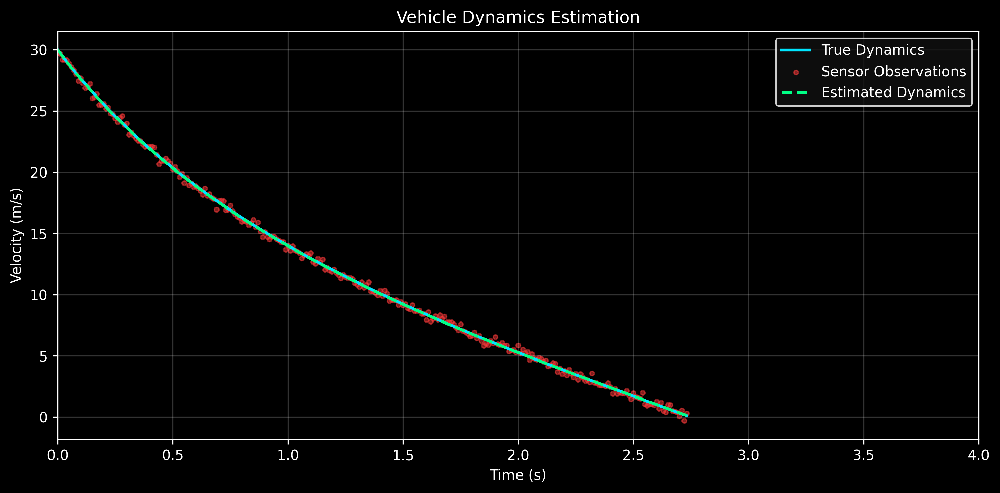

# Vehicle Dynamics & Physics-Informed Parameter Estimation

A computational framework for modeling vehicle longitudinal braking dynamics using first-principles physics, numerical simulation, and inverse parameter estimation.

The project bridges:
- Classical mechanics  
- Nonlinear differential equations  
- Numerical ODE solvers  
- Tire slip modeling  
- Physics-informed parameter estimation  

---

# Overview

This system models how a vehicle slows down under braking and aerodynamic drag, then uses observed motion data to estimate hidden physical parameters such as:

- Tire-road friction coefficient (μ)
- Aerodynamic drag coefficient (Cd)
- Air density (ρ)
- Tire slip response parameters

## System Identification Results

| Method | μ Estimate | Error | Characteristics |
|--------|------------|-------|-----------------|
| True | 0.7000 | — | Ground truth |
| SciPy Batch | 0.6988 | 0.17% | Offline optimal |
| EKF | 0.6756 | 3.5% | Real-time |
| Neural Net | 0.6854 | 2.1% | Fast inference |

# Estimation Results

The project is structured as:

> **Forward Model (Physics Simulation) → Data → Inverse Model (Parameter Estimation)**

---

# Physical Derivation (First Principles)

## 1. Newton’s Second Law

We begin with:

**F = ma**

For longitudinal vehicle motion:

**m dv/dt = ΣF**

---

## 2. Forces Acting on the Vehicle

### (a) Tire Friction Force

Normal force:

**N = mg**

Friction force:

**F_f = μN = μmg**

---

### (b) Aerodynamic Drag

**F_d = (1/2) ρ C_d A v²**

Where:
- ρ = air density  
- C_d = drag coefficient  
- A = frontal area  
- v = velocity  

---

## 3. Governing Equation of Motion

Summing forces:

**m dv/dt = -F_f - F_d**

Substituting:

**m dv/dt = -μmg - (1/2) ρ C_d A v²**

---

### Final simplified form:

\[
\frac{dv}{dt} = -\mu g - \frac{\rho C_d A}{2m} v^2
\]

---

# Tire Slip Model (Nonlinear Extension)

To capture real tire behavior, friction is modeled as a function of slip ratio.

## Slip Ratio

\[
s = \frac{R\omega - v}{v}
\]

Where:
- R = tire radius  
- ω = wheel angular velocity  
- v = vehicle velocity  

---

## Nonlinear Friction Model

Instead of constant μ:

\[
\mu = \mu(s)
\]

A simple saturating model:

\[
\mu(s) = \mu_{\max}(1 - e^{-Cs})
\]

This captures:
- low slip → low friction  
- optimal slip → peak friction  
- high slip → saturation  

---

# Full Dynamic System

\[
m \frac{dv}{dt}
=
-\mu(s)mg
-\frac{1}{2}\rho C_d A v^2
\]

This nonlinear ODE is solved numerically.

---

# Numerical Methods

The system is solved using:

- Euler integration (baseline)
- Runge-Kutta 4th order (RK4)
- SciPy ODE solvers (reference solution)

We compare:
- stability  
- accuracy  
- computational cost  

---

# Parameter Estimation (Inverse Problem)

Given observed velocity data:

\[
v_{obs}(t)
\]

We estimate parameters:

\[
\theta = \{\mu, C_d, \rho, \text{slip parameters}\}
\]

---

## Optimization Objective

\[
\mathcal{L}(\theta) = \sum (v_{obs}(t) - v_{sim}(t, \theta))^2
\]

This minimizes the difference between observed and simulated trajectories.

---

# System Pipeline

Physics Derivation
↓
Forward Simulation (ODE Model)
↓
Synthetic / Real Telemetry
↓
Noise Injection (Sensor Model)
↓
Parameter Estimation (Optimization / ML)
↓
Validation & Visualization

---

# Project Structure

src/
├── physics/ # governing equations
├── solvers/ # Euler, RK4, ODE solvers
├── simulation/ # forward vehicle model
├── estimation/ # parameter fitting / optimization
├── ml/ # regression / hybrid models
├── visualization/ # plots and analysis

---

# Outputs

The system produces:

- Velocity vs time curves  
- Stopping distance predictions  
- Estimated physical parameters  
- Model fit comparisons  
- Solver accuracy benchmarks  

---

# Extensions

Future directions:

- Kalman filtering for real-time estimation  
- Bayesian uncertainty quantification  
- Real telemetry (OBD-II / GPS)  
- Road condition classification (wet / dry / ice)  
- Physics-informed neural estimation  

---

# Why This Project Matters

This project demonstrates:

- First-principles physical modeling  
- Numerical simulation of nonlinear systems  
- System identification and inverse modeling  
- Integration of physics and machine learning  
- Engineering-grade software architecture  

It sits at the intersection of:
- vehicle dynamics  
- computational physics  
- robotics  
- applied machine learning  
