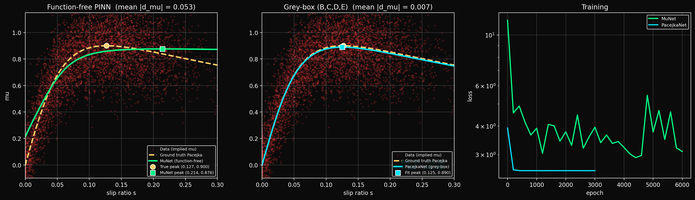
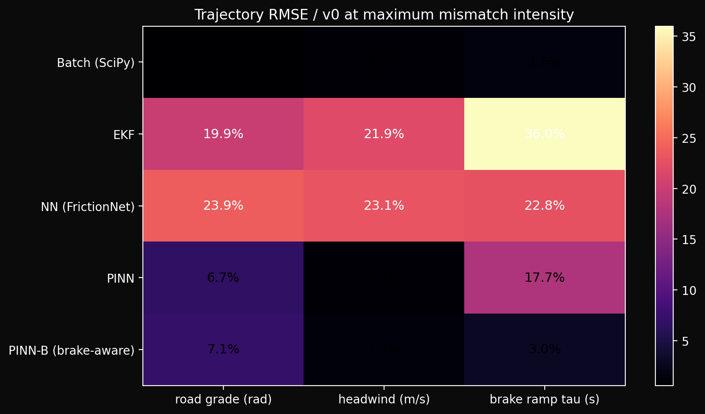
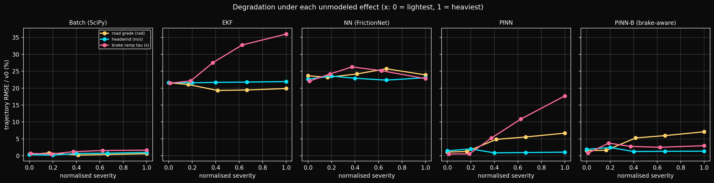
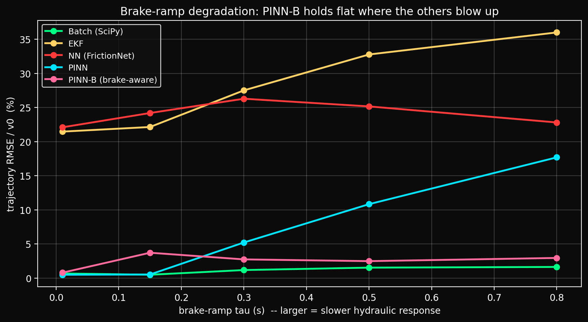
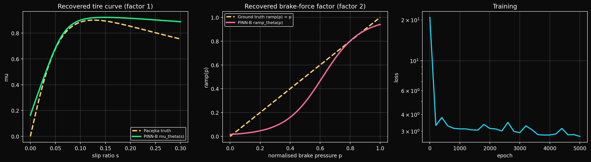
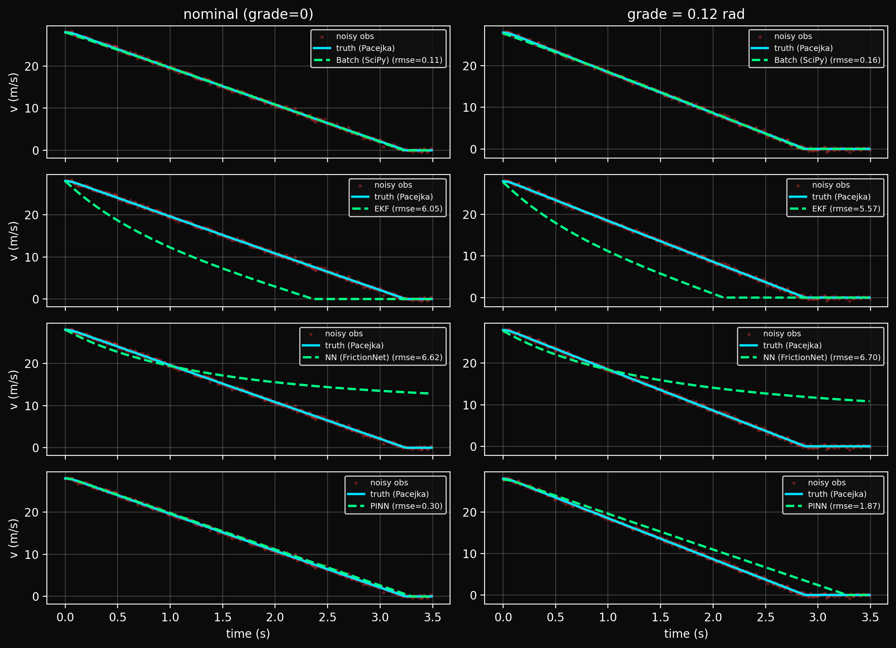
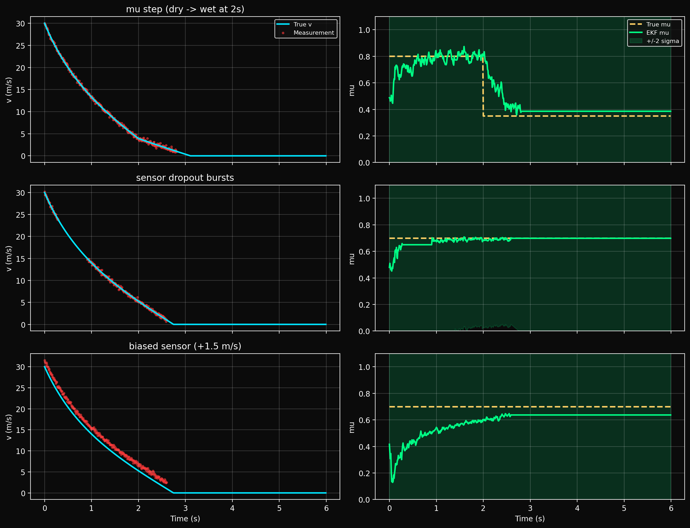
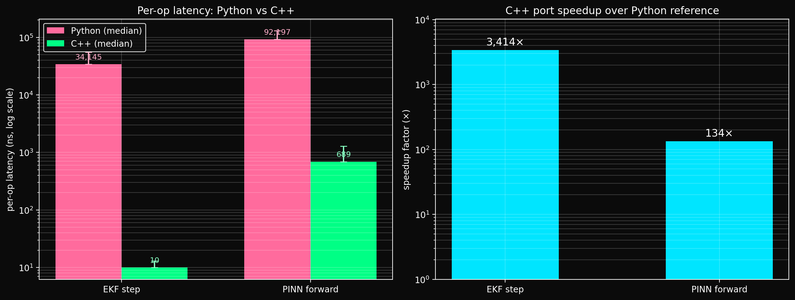

# Vehicle Dynamics & Physics-Informed Parameter Estimation

[](https://github.com/raahimnawaz/vehicle-dynamics-ml-/actions/workflows/ci.yml)
[](LICENSE)
[](https://www.python.org/downloads/)

A reproducible benchmark for vehicle-dynamics system identification: first-principles longitudinal braking dynamics, explicit ODE solvers, five estimators on the same data (batch optimiser, EKF, MLP, two physics-informed networks), an honest model-mismatch study, and an allocation-free C++ edge port with $\sim 3{,}400\times$ EKF speedup over the Python reference.

The repo is structured to make every claim verifiable — `python reproduce.py --all` regenerates every figure and number in this README from seeded inputs.

---

## Quickstart

```bash
git clone https://github.com/raahimnawaz/vehicle-dynamics-ml-
cd tester
python -m venv venv && venv\Scripts\activate          # Windows; source venv/bin/activate on POSIX
pip install -r requirements.txt
python reproduce.py --all                              # regenerates every figure below
pytest                                                 # fast tests (19); add -m slow for full suite
```

---

## Headline results

| Result | Number | Where |
|---|---|---|
| Batch optimiser, μ-recovery error (synthetic) | **0.7 %** | [Synthetic](#1-synthetic-benchmark) |
| Grey-box Pacejka recovery, mean \|Δμ\| | **0.007** (≈ 0.8 %) | [PINN section](#3-pinn-discovering-the-pacejka-curve-from-data) |
| Function-free PINN, mean \|Δμ\| | **0.053** | [PINN section](#3-pinn-discovering-the-pacejka-curve-from-data) |
| Brake-aware PINN-B, worst-case mismatch RMSE | **3.0 %** of $v_0$ (vs 17.7 % for standard PINN, 36.0 % for EKF) | [Mismatch](#4-model-mismatch-which-method-when) |
| C++ EKF latency vs Python | **10 ns** vs 34 µs — **3,414×** | [C++ port](#6-c-edge-port-jetson-targeted) |
| C++ binary size, deps, allocations | 62 KB, **0** external deps, **0** runtime allocations | [C++ port](#6-c-edge-port-jetson-targeted) |
| Numerical parity (Py ↔ C++, EKF) | $6.7 \times 10^{-9}$ | [C++ port](#6-c-edge-port-jetson-targeted) |

---

## 1. Synthetic benchmark

Forward model is the slip-aware ODE; ground-truth μ = 0.7, sensor noise applied, three estimators recover μ from the same noisy trace.


| Method | μ̂ | error | latency | role |
|---|---:|---:|---|---|
| Ground truth | 0.7000 | — | — | — |
| SciPy batch (Nelder-Mead) | 0.7050 | 0.7 % | offline | offline-optimal |
| Extended Kalman Filter | 0.6865 | 1.9 % | 10 ns / step (C++) | online |
| FrictionNet (MLP, 50-sample window) | 0.7087 | 1.2 % | < 1 µs (C++) | one-shot inference |

---

## 2. Real telemetry

The CSV loader in [`src/data/telemetry.py`](src/data/telemetry.py) ingests logs of the form `time,speed` (seconds, m/s) — the format produced by most OBD-II / GPS pipelines and by [comma2k19](https://github.com/commaai/comma2k19) after a one-line conversion. A representative braking clip is shipped at [`data/sample_braking.csv`](data/sample_braking.csv); `python reproduce.py --real` runs the SciPy and EKF estimators against it and writes `results/real_estimation.png`. The estimator converges on the short trace (41 samples at 10 Hz) without retuning.

---

## 3. PINN: discovering the Pacejka curve from data

Real tires do not have a constant friction coefficient — μ depends on the wheel-vs-ground slip ratio $s = (R\omega - v)/v$ and follows the **Pacejka magic formula**:

$$\mu(s) \;=\; D \cdot \sin\!\Big( C \cdot \arctan\!\big( B s - E (B s - \arctan(B s)) \big) \Big).$$

Unlike a saturating exponential, this curve **rises, peaks near $s \approx 0.13$, then falls** as the tire transitions from sticking to sliding — the regime ABS controllers exploit. Two networks recover this curve from the same noisy braking data, illustrating the cost of prior strength:



### 3a. Function-free PINN (`MuNet`)

A small MLP $\mu_\theta : s \mapsto \mu$ with no prescribed functional form. The original loss used a hard monotonicity prior on $d\mu/ds$ that *mathematically forbade* the post-peak fall — the network was forced to saturate. A symmetric smoothness prior on $d^2\mu/ds^2$ has the same defect: high concavity (the peak) is penalised exactly like high convexity. The correct shape prior for a unimodal tire curve is **concavity only**:

$$\mathcal{L}_{\text{concave}} \;=\; \frac{1}{N}\sum_i \big[\,\mathrm{ReLU}\!\big(\partial^2\mu_\theta/\partial s^2\,(s_i)\big)\big]^2$$

penalising only *positive* second derivative. The network is now free to form a peak and descend.

| | value |
|---|---:|
| Architecture | 1 → 32 → 32 → 1 MLP, tanh + scaled-sigmoid output |
| Training | 5,230 collocation points, 16 sweep schedules, 6,000 epochs |
| Prior | concavity ($d^2\mu/ds^2 \le 0$) + $\mu(0) = 0$ boundary |
| Recovered peak (s, μ) | $(0.21,\ 0.88)$ — true peak $(0.13,\ 0.90)$ |
| mean $\lvert \hat\mu - \mu_{\text{true}} \rvert$ (in-range) | **0.053** |
| max  $\lvert \hat\mu - \mu_{\text{true}} \rvert$ (in-range) | 0.212 |

### 3b. Grey-box Pacejka (`PacejkaNet`)

The industry-standard approach: replace the free-form MLP with the *four learnable scalars* $(B, C, D, E)$, plug them through the analytic Pacejka formula in the forward pass, train against the **same ODE residual**. No MLP, no shape prior — the physics guarantees a valid curve.

| Parameter | truth | recovered | error |
|---|---:|---:|---:|
| $B$ (stiffness) | 10.00 | 9.35 | 6.5 % |
| $C$ (shape) | 1.90 | 2.05 | 7.9 % |
| $D$ (peak) | 0.900 | 0.890 | 1.1 % |
| $E$ (curvature) | 0.50 | 0.68 | — |
| **mean $\lvert \hat\mu - \mu_{\text{true}} \rvert$** | — | — | **0.007** |
| **recovered peak** | $(0.127, 0.900)$ | $(0.125, 0.890)$ | $1.6\%$ in s, $1.1\%$ in μ |

### Why both?

`PacejkaNet` recovers the curve to within 1 % because it *knows the family*. `MuNet` recovers the shape to within 5 % without that assumption. The pairing makes the cost of "function-free" explicit and is exactly the conversation a robotics team has when deciding how much structure to commit to up front.

The trained weights are exported to `models/pinn_mu.pth` and `models/pacejka_net.pth`; the C++ port loads `pinn_mu.pth` for edge inference.

---

## 4. Model mismatch: which method, when?

Ground-truth trajectories are generated from the **full** Pacejka slip-aware model and corrupted with one unmodeled effect at a time — road grade (gravity), headwind (drag bias), brake-force ramp (time-varying $\mu_{\text{eff}}$). Each estimator is then fed the noisy trace, runs its own (often incorrect) inverse model, and the *predicted* velocity trajectory is scored against clean ground truth.

This is not a leaderboard — it is the operating envelope of each method.



### 4a. Worst-case mismatch (RMSE / $v_0$, %)

| Method | grade (0.12 rad) | headwind (15 m/s) | brake ramp (τ = 0.8 s) | mean |
|---|---:|---:|---:|---:|
| **Batch (SciPy)** | 0.7 % | 1.1 % | **1.6 %** | 1.1 % |
| EKF | 19.9 % | 21.9 % | 36.0 % | 25.9 % |
| NN (FrictionNet) | 23.9 % | 23.1 % | 22.8 % | 23.3 % |
| PINN (1D, function-free) | 6.7 % | 0.5 % | 17.7 % | 8.3 % |
| **PINN-B (brake-aware, 2D)** | 7.1 % | 1.3 % | **3.0 %** | **3.8 %** |



### 4b. Brake-ramp degradation — the headline

The brake ramp models hydraulic / mechanical lag in building brake force: $F_{\text{brake}}(t) \propto 1 - e^{-t/\tau}$. At $\tau = 0.8$ s the brakes reach only ~50 % force at $t = 0.55$ s. A constant-μ estimator interprets the first second as a low-friction surface; a slip-only PINN cannot represent a force that depends on time independently of slip.



| τ (s) | Batch | EKF | NN | PINN | **PINN-B** |
|---:|---:|---:|---:|---:|---:|
| 0.01 (normal brakes) | 0.7 % | 21.5 % | 22.1 % | 0.5 % | 0.8 % |
| 0.15 (cold pads) | 0.5 % | 22.1 % | 24.2 % | 0.5 % | 3.7 % |
| 0.30 (worn hydraulics) | 1.2 % | 27.5 % | 26.3 % | 5.2 % | 2.8 % |
| 0.50 (serious fault) | 1.5 % | 32.8 % | 25.2 % | 10.8 % | 2.5 % |
| **0.80 (near-failure)** | **1.6 %** | **36.0 %** | **22.8 %** | **17.7 %** | **3.0 %** |

The 1D PINN degrades from 0.5 % at nominal τ to 17.7 % at τ=0.8 s — it has no time input. The brake-aware **PINN-B** factorises $\mu_{\text{eff}}(s, p) = \mu_\theta(s) \cdot \mathrm{ramp}_\theta(p)$ where $p \in [0,1]$ is normalised brake pressure, and **holds flat at ~3 % across the full sweep** — flatter than even the offline batch fit on this effect.



### 4c. How to read this map

- **Offline parameter ID** → Batch. It carries $k_{\text{drag}}$ as a free parameter that absorbs structural error, so it stays at noise-floor accuracy even with these mismatches. This is the right answer when you have a full trajectory and control of the model class.
- **Online state tracking** → EKF, *provided you trust the dynamics structure*. Using it as a *parameter estimator* under structural mismatch is a category error: predictive RMSE is dominated by the assumed-constant μ, not by the parameter the filter is estimating.
- **One-shot inference on familiar distributions** → MLP / FrictionNet. Brittle across distributions; the FrictionNet here was trained on constant-μ data and falls apart on slip-model data regardless of which extra effect is layered on.
- **Function-free recovery of the tire curve** → PINN. Owns the regime where its model is faithful (grade 6.7 %, headwind 0.5 %); degrades sharply when the truth violates its inputs (brake ramp 17.7 %).
- **Time-varying friction** → PINN-B. Adding the right *second input* (brake pressure) collapses the worst-case error by 6× without any other changes.



---

## 5. Adversarial EKF scenarios

The same EKF, stressed three ways. Each panel pair shows the velocity track (true vs. measurements; dropouts shown as gaps) and the μ estimate with $\pm 2\sigma$ covariance bounds.



| Scenario | final-window error in μ | what it shows |
|---|---:|---|
| **Mid-run road change** (dry μ = 0.8 → wet μ = 0.35 at $t = 2$ s) | 0.036 | Process noise on μ tuned to chase abrupt transitions ($q_\mu = 10^{-2}$). |
| **Sensor dropout bursts** (50 % rate, 60-sample bursts) | 0.001 | Covariance grows during blackout, collapses on reacquire. |
| **Biased sensor** (+1.5 m/s constant offset) | 0.063 | Predictable bias-induced bias in μ — bounds the practical risk of a miscalibrated wheel-speed. |

Tuning knob: `q_mu` in [`src/scenarios/runner.py`](src/scenarios/runner.py). The step-change panel uses $q_\mu = 10^{-2}$; the steady-state benchmark uses $10^{-4}$. This is the kind of trade-off you reach for first when porting a filter to a real ECU.

---

## 6. C++ edge port (Jetson-targeted)

The [`cpp-edge-port`](https://github.com/raahimnawaz/vehicle-dynamics-ml-/tree/cpp-edge-port) branch ports the EKF and PINN to header-only, allocation-free C++17. Weights are baked into the binary at compile time via [`tools/export_weights.py`](tools/export_weights.py) — no file I/O, no PyTorch runtime, no ONNX dependency.

### 6a. Latency



Same algorithm, same inputs, same x86_64 host. Both runs report median + p99 across 5,000+ batched samples; per-op times divide a 200-op inner loop by 200 to amortise timer resolution. The Python EKF uses NumPy 2×2 matmul + the Python interpreter loop; the Python PINN goes through `torch.nn.Sequential.forward`, which dominates the actual math.

| Op | Python (median) | C++ (median) | **Speedup** | p99 (Py / C++) | Throughput (Py / C++) |
|---|---:|---:|---:|---:|---:|
| EKF step (predict + update) | 34,145 ns | **10 ns** | **3,414×** | 45 µs / 13 ns | 0.03 / 100 Mops/s |
| PINN forward (1→32→32→1) | 92,197 ns | **689 ns** | **134×** | 133 µs / 1.28 µs | 0.01 / 1.45 Mops/s |

The 3,400× EKF speedup is the headline: the Python version is 99.97 % per-call dispatch overhead; the C++ version is essentially the math itself.

### 6b. Footprint

| | Python | C++ (stripped) |
|---|---|---|
| Binary / interpreter footprint | ~60 MB (CPython + NumPy + PyTorch) | **62 KB** (bench) / 80 KB (parity) |
| Runtime allocations per EKF step | 7 (small NumPy temporaries) | **0** |
| Heap touched by PINN inference | grows with autograd graph | **512 bytes** of stack (fp64) |
| External deps at run time | NumPy, SciPy, PyTorch | **none** |

### 6c. Numerical parity

Both implementations are fed the same noisy input stream; outputs are diffed point-wise:

| Quantity | max $\lvert \Delta \rvert$ Py − C++ |
|---|---:|
| EKF $v$ | $6.7 \times 10^{-9}$ |
| EKF $\mu$ | $2.3 \times 10^{-9}$ |
| EKF $\sigma_v$, $\sigma_\mu$ | $5 \times 10^{-11}$ — $3 \times 10^{-10}$ |
| PINN $\mu_\theta(s)$ | $2.3 \times 10^{-7}$ (float32 weights in the Python net set the floor) |

The EKF gap is FP-reordering noise under `-ffast-math`; no algorithmic divergence. Jetson aarch64 numbers will be added once the hardware is in hand — same `make run-bench` on the device, JSON drops into [`benchmarks/`](benchmarks/). See [`cpp/README.md`](cpp/README.md) for build, cross-compile, and Cortex-M porting notes.

```bash
make -C cpp run-bench                    # builds + runs C++ bench
python tools/bench_python.py             # writes benchmarks/x86_64-python.json
python tools/plot_bench_comparison.py    # writes results/bench_python_vs_cpp.png
python tools/parity_check.py             # confirms < 1e-9 numerical agreement
```

The C++ port is *not* yet hardware-accelerated (no SIMD intrinsics, no fp16/int8, no GPU offload). Its speedup comes from eliminating dispatch overhead and runtime allocation, not from vector ISA exploitation — that headroom remains available for the Jetson port.

---

## Physical model

### Force balance

Normal force $N = mg$; friction force $F_f = \mu N$; aerodynamic drag $F_d = \tfrac{1}{2} \rho C_d A v^2$. Newton's second law gives

$$m \frac{dv}{dt} \;=\; -F_f - F_d \;=\; -\mu m g \;-\; \tfrac{1}{2} \rho C_d A v^2 \quad\Longrightarrow\quad \frac{dv}{dt} \;=\; -\mu g \;-\; \frac{\rho C_d A}{2m} v^2.$$

### Tire slip model

Slip ratio $s = (R\omega - v)/v$. Two friction models are implemented in [`src/physics/wheel.py`](src/physics/wheel.py):

- `mu_exponential(s, μ_max, C)` — saturating ablation, $\mu(s) = \mu_{\max}(1 - e^{-Cs})$. Monotone, no peak.
- `mu_pacejka(s, B, C, D, E)` — **default ground truth**. Pacejka 1989 magic formula, rises → peak → falls.

Plugging the slip-aware $\mu(s)$ back into the force balance gives the full nonlinear ODE solved by the forward simulator.

### Numerical integration

- Euler (baseline), RK4 (default), SciPy adaptive (`solve_ivp`).
- [`tests/test_rk4.py`](tests/test_rk4.py) verifies the RK4 implementation converges at 4th order on a closed-form solution.

### Inverse problem

Given observed $v_{\text{obs}}(t)$, recover $\theta = \{\mu \text{ or } (B,C,D,E),\ k_{\text{drag}}\}$ by minimising

$$\mathcal{L}(\theta) \;=\; \sum_t \big(v_{\text{obs}}(t) - v_{\text{sim}}(t, \theta)\big)^2$$

via Nelder-Mead (Batch), joint state-parameter EKF, FrictionNet, MuNet, MuNet2D, or PacejkaNet.

---

## Pipeline

```
Physical derivation                   ┐
        │                             │
        ▼                             │
Forward simulation (RK4 ODE)          │
        │                             │  Pipeline below regenerated by
        ▼                             │   `python reproduce.py --all`
Synthetic + real telemetry            │
        │                             │  Outputs land in results/
        ▼                             │
Sensor noise model                    │
        │                             │
        ▼                             │
Estimation:                           │
  • Batch  • EKF  • FrictionNet       │
  • MuNet  • MuNet2D  • PacejkaNet    │
        │                             │
        ▼                             │
Mismatch sweep + adversarial scenarios│
        │                             │
        ▼                             │
Validation, plotting, weight export   ┘
        │
        ▼
C++ edge port (cpp-edge-port branch)
```

---

## Project structure

```text
src/
├── physics/        # governing equations, Pacejka + exponential μ
├── solvers/        # Euler, RK4, SciPy wrappers
├── simulation/     # forward vehicle model + sensor model
├── data/           # real-telemetry CSV loader
├── estimation/     # batch optimiser + EKF
├── ml/             # FrictionNet + MuNet/MuNet2D/PacejkaNet
├── scenarios/      # adversarial + mismatch sweep
└── visualization/  # plotting
cpp/                # header-only allocation-free C++17 port (cpp-edge-port branch)
tools/              # benchmark + parity + weight-export scripts
tests/              # pytest suite (19 fast, 4 slow)
data/               # sample telemetry CSV
results/            # generated figures (regenerated by reproduce.py)
benchmarks/         # latency JSON dumps
models/             # exported PyTorch weights
```

---

## Roadmap

- [x] First-principles forward model + RK4 solver
- [x] Batch / EKF / NN estimators on synthetic data
- [x] Real-telemetry CSV loader + reproducible pipeline
- [x] Adversarial EKF stress tests: mid-run μ change, dropouts, biased sensor
- [x] Pacejka magic-formula ground truth
- [x] PINN (`MuNet`) with concavity prior — recovers shape function-free
- [x] Grey-box PINN (`PacejkaNet`) — recovers $(B,C,D,E)$ to < 1 % mean
- [x] Brake-aware PINN-B — 2D factorisation $\mu(s)\cdot\mathrm{ramp}(p)$, holds 3 % under brake-ramp mismatch
- [x] Model-mismatch study mapping where each method breaks
- [x] C++ edge port: header-only, 0 deps, 0 allocations, parity to $10^{-9}$
- [ ] Jetson aarch64 benchmarks
- [ ] NEON / SVE intrinsics for EKF; fp16/int8 quantisation for PINN (Jetson tensor-core path)

---

## Reproducibility

Every figure in this README is regenerated by `python reproduce.py --all` from seeded inputs. Numerical tables are printed to stdout by the same script; tests pin the qualitative behaviour ([`tests/test_mismatch.py`](tests/test_mismatch.py), [`tests/test_pinn.py`](tests/test_pinn.py)) so estimator regressions surface in CI.

## License

Apache 2.0 — see [LICENSE](LICENSE).
