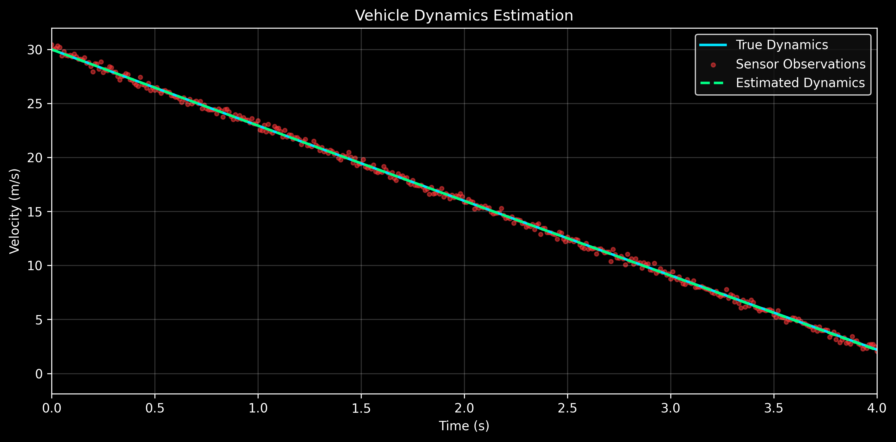
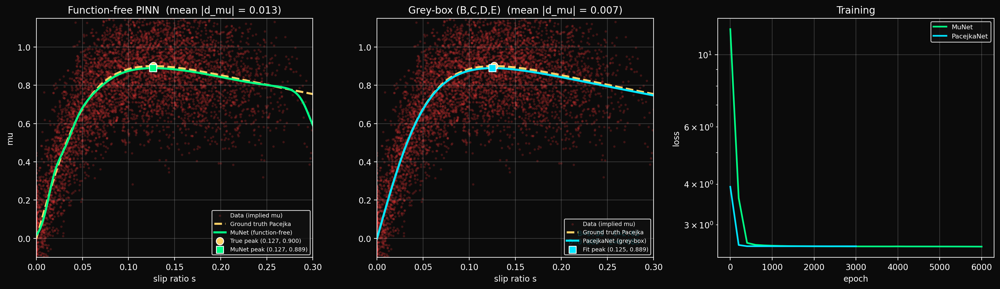
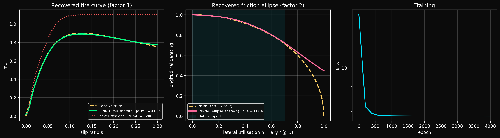
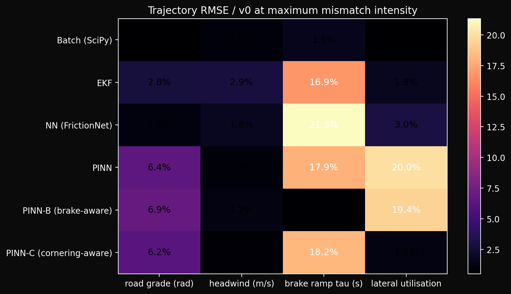
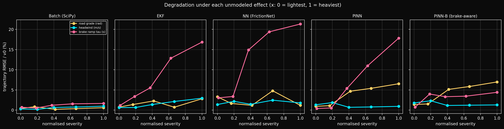
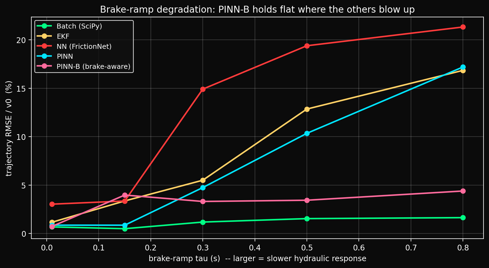
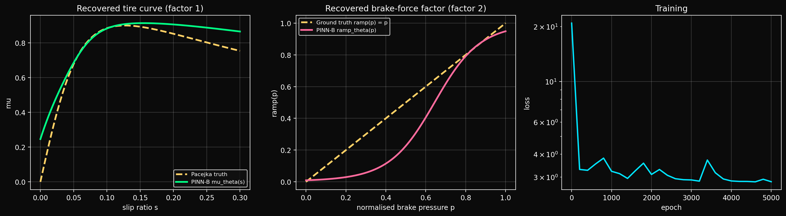
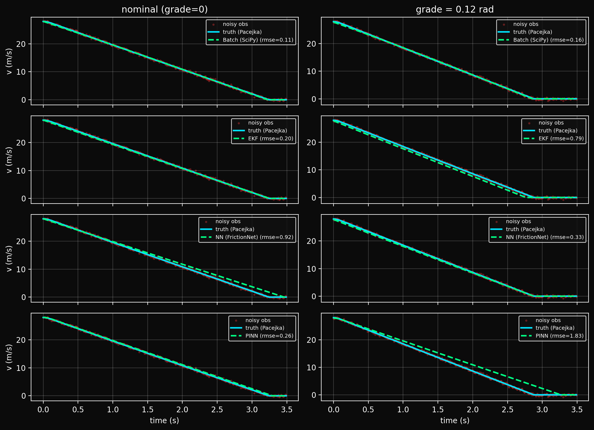
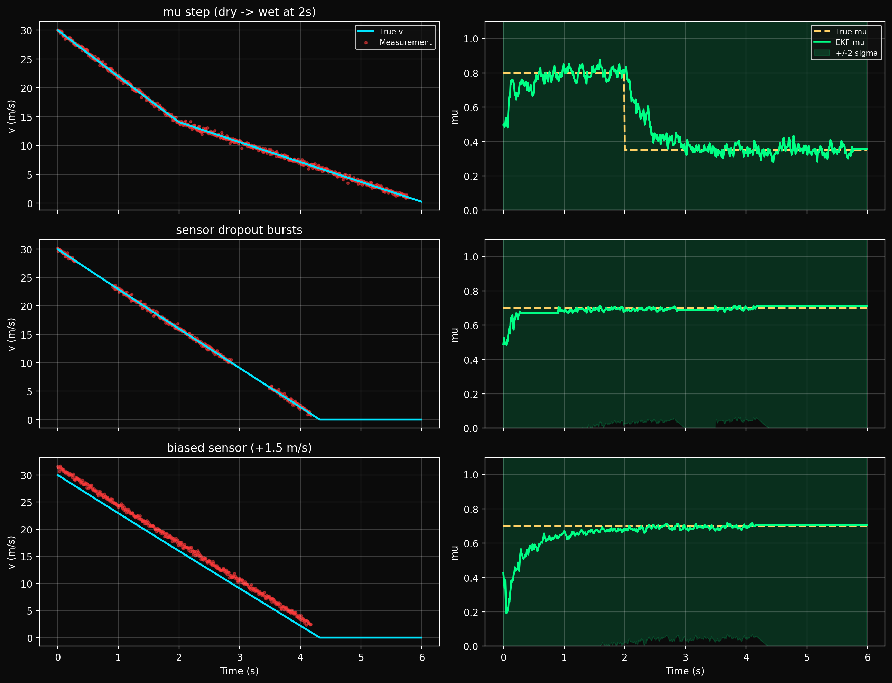
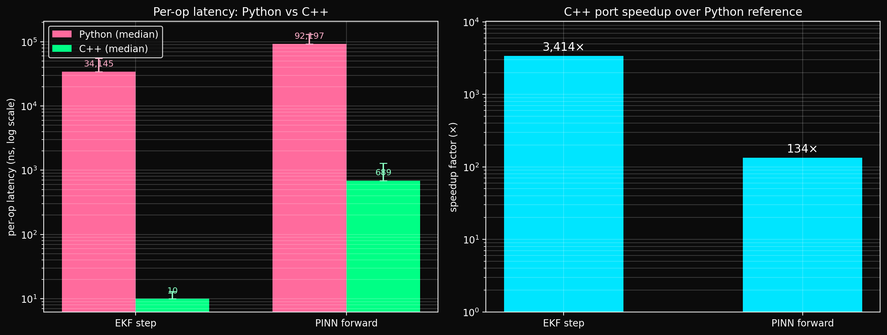

# Vehicle Dynamics & Physics-Informed Parameter Estimation

[](https://github.com/raahimnawaz/vehicle-dynamics-estimation/actions/workflows/ci.yml)
[](LICENSE)
[](https://www.python.org/downloads/)

A reproducible benchmark for vehicle-dynamics system identification: first-principles longitudinal braking dynamics, explicit ODE solvers, five estimators on the same data (batch optimiser, EKF, MLP, two physics-informed networks), an honest model-mismatch study, and an allocation-free C++ edge port that matches the Python reference to $10^{-9}$.

The repo is structured to make every claim verifiable — `python reproduce.py --all` regenerates every figure and number in this README from seeded inputs. [Corrections](#corrections) documents an August 2026 audit that moved several of them.

---

## Quickstart

```bash
git clone https://github.com/raahimnawaz/vehicle-dynamics-estimation
cd vehicle-dynamics-estimation
python -m venv venv && source venv/bin/activate      # venv\Scripts\activate on Windows
pip install -r requirements.txt
python reproduce.py --all                            # regenerates every figure below
pytest                                               # 25 fast tests; add -m slow for the full suite
```

---

## Headline results

| Result | Number | Where |
|---|---|---|
| Batch optimiser, μ-recovery error (synthetic) | **0.3 %** | [Synthetic](#1-synthetic-benchmark) |
| Grey-box Pacejka recovery, mean \|Δμ\| | **0.007** | [PINN](#3-pinn-discovering-the-pacejka-curve-from-data) |
| Function-free PINN, mean \|Δμ\| | **0.013** | [PINN](#3-pinn-discovering-the-pacejka-curve-from-data) |
| Function-free PINN, recovered peak | **(0.124, 0.890)** vs true (0.127, 0.900) | [PINN](#3-pinn-discovering-the-pacejka-curve-from-data) |
| Combined-slip PINN, mean \|Δμ\| / \|Δellipse\| | **0.005** / **0.004** | [Combined slip](#3c-combined-slip-the-friction-ellipse-munetcombined) |
| Combined-slip PINN-C, worst-case cornering RMSE | **2.0 %** of $v_0$ (vs 19.9 % PINN, 19.4 % PINN-B) | [Mismatch](#4-model-mismatch-which-method-when) |
| Brake-aware PINN-B, worst-case brake-ramp RMSE | **4.4 %** of $v_0$ (vs 16.9 % EKF, 17.8 % PINN, 21.3 % MLP) | [Mismatch](#4-model-mismatch-which-method-when) |
| C++ EKF latency | **7 ns** median, 9 ns p99 (Apple M-series) | [C++ port](#6-c-edge-port) |
| C++ binary, deps, allocations | 35 KB, **0** external deps, **0** runtime allocations | [C++ port](#6-c-edge-port) |
| Numerical parity (Py ↔ C++) | $7.4 \times 10^{-9}$ EKF, $1.9 \times 10^{-7}$ PINN | [C++ port](#6-c-edge-port) |

---

## 1. Synthetic benchmark

Constant-μ forward model, ground-truth μ = 0.7, sensor noise applied, three estimators recover μ from the same noisy trace.



| Method | μ̂ | error | latency | role |
|---|---:|---:|---|---|
| Ground truth | 0.7000 | — | — | — |
| SciPy batch (Nelder-Mead) | 0.7021 | 0.3 % | offline | offline-optimal |
| Extended Kalman Filter | 0.6869 | 1.9 % | 7 ns / step (C++) | online |
| FrictionNet (MLP, 50-sample window) | 0.7400 | 5.7 % | 262 ns (C++ PINN path) | one-shot inference |

The MLP is the weakest of the three here, and that is expected rather than disappointing — it has no physics and must infer a slope from 50 raw velocity samples. With the corrected (physical) drag coefficient, velocity falls only 3.5 m/s across its window against 0.5 m/s of sensor noise. Under the old, unphysically large drag the same window spanned 9.5 m/s, so the network had a 2.7× stronger signal and looked correspondingly more accurate.

---

## 2. Real telemetry

The CSV loader in [`src/data/telemetry.py`](src/data/telemetry.py) ingests logs of the form `time,speed` (seconds, m/s) — the format produced by most OBD-II / GPS pipelines and by [comma2k19](https://github.com/commaai/comma2k19) after a one-line conversion. A representative braking clip ships at [`data/sample_braking.csv`](data/sample_braking.csv); `python reproduce.py --real` runs the SciPy and EKF estimators against it and writes `results/real_estimation.png`.

| Method | μ̂ |
|---|---:|
| SciPy batch | 0.8333 |
| EKF (final) | 0.7482 |

Both converge on the short trace (41 samples at 10 Hz) without retuning. There is no ground truth for this clip, so the useful signal is agreement between two independent estimators rather than either value on its own.

---

## 3. PINN: discovering the Pacejka curve from data

Real tires do not have a constant friction coefficient — μ depends on the wheel-vs-ground slip ratio $s = (R\omega - v)/v$ and follows the **Pacejka magic formula**:

$$\mu(s) \;=\; D \cdot \sin\!\Big( C \cdot \arctan\!\big( B s - E (B s - \arctan(B s)) \big) \Big).$$

Unlike a saturating exponential, this curve **rises, peaks near $s \approx 0.13$, then falls** as the tire transitions from sticking to sliding. That fall is not a detail: left of the peak the tire is self-correcting (more slip gives more force), while right of it $d\mu/ds < 0$ and the loop inverts — more slip gives less force, the wheel decelerates faster than the vehicle, and slip grows further. That is wheel lock, an open-loop instability, and holding the operating point just left of the peak is what an ABS controller exists to do.

Two networks recover this curve from the same noisy braking data, illustrating the cost of prior strength; a third (§3c) adds the lateral axis:



### 3a. Function-free PINN (`MuNet`)

A small MLP $\mu_\theta : s \mapsto \mu$ with no prescribed functional form and — after the audit below — **no shape prior at all**.

| | value |
|---|---:|
| Architecture | 1 → 32 → 32 → 1 MLP, tanh + scaled-sigmoid output |
| Training | 5,230 collocation points, 16 sweep schedules, 6,000 epochs |
| Constraint | $\mu(0) = 0$ boundary only |
| Recovered peak (s, μ) | $(0.124,\ 0.890)$ — true peak $(0.127,\ 0.900)$ |
| mean $\lvert \hat\mu - \mu_{\text{true}} \rvert$ (in-range) | **0.013** |
| max  $\lvert \hat\mu - \mu_{\text{true}} \rvert$ (in-range) | 0.073 |

#### Three shape priors, three false claims about tire physics

This is the most useful thing in the repo, so it is worth stating in full. The loss carried three successive shape priors and **every one of them encoded a claim about the tire curve that was false**:

1. **Monotonicity**, penalising $d\mu/ds < 0$. A real tire curve falls after the peak, so this forbade the correct answer outright. The network saturated, and it read as a capacity problem rather than a specification error.

2. **Symmetric smoothness**, penalising $(\partial^2\mu/\partial s^2)^2$. The same defect in disguise — it punishes the concavity that *forms* the peak exactly as hard as the convexity it was meant to suppress.

3. **One-sided concavity**, penalising $\mathrm{ReLU}(\partial^2\mu/\partial s^2)^2$. Subtler, and the version this repo shipped for months. The true Pacejka curve is **convex on $s \in [0.233, 0.300]$** — 22.3 % of the evaluation range — because the post-peak fall flattens toward the sliding-friction asymptote. The prior penalises exactly that flattening; the penalty it assigns to the *ground-truth curve* is 0.34.

With prior (3) active the recovered curve had no interior peak at all — its maximum sat at the right edge of the grid on every seed tested. Removing it:

| | peak location (3 seeds) | mean \|Δμ\| |
|---|---|---:|
| `lam_concave = 1.0` | 0.300, 0.300, 0.300 | 0.061 |
| `lam_concave = 0.0` | 0.124, 0.127, 0.125 | **0.013** |

The data never needed the help. Pointwise inversion of the ODE residual puts the empirical peak at $(0.110,\ 0.897)$ against a true $(0.127,\ 0.900)$, with the post-peak fall clearly resolved above the sample noise. The shape was always in the measurements; each prior was an assumption fighting them.

The 1D problem is well posed — $\mu(s)$ is the only unknown, so the ODE residual already determines it and any shape prior can only inject bias. Only the $\mu(0) = 0$ boundary remains, and that is physics (no force without slip) rather than a guess about curve shape.

**The 2D net keeps its prior, deliberately.** `MuNet2D` factorises $\mu_{\text{eff}}(s,p) = \mu_\theta(s)\cdot\mathrm{ramp}_\theta(p)$, which is *under-determined*: many (shape, scale) splits fit the residual equally well. Dropping the concavity prior there degrades mean $\lvert\Delta\mu(s)\rvert$ from ~0.055 to ~0.309 over three seeds. Prior off where the problem is identifiable; prior on where it is not.

### 3b. Grey-box Pacejka (`PacejkaNet`)

The industry-standard approach: replace the free-form MLP with the *four learnable scalars* $(B, C, D, E)$, plug them through the analytic Pacejka formula in the forward pass, train against the **same ODE residual**. No MLP, no shape prior — the physics guarantees a valid curve.

| Parameter | truth | recovered | error |
|---|---:|---:|---:|
| $B$ (stiffness) | 10.00 | 9.35 | 6.5 % |
| $C$ (shape) | 1.90 | 2.05 | 7.9 % |
| $D$ (peak) | 0.900 | 0.890 | 1.1 % |
| $E$ (curvature) | 0.50 | 0.68 | — |
| **mean $\lvert \hat\mu - \mu_{\text{true}} \rvert$** | — | — | **0.007** |
| **recovered peak** | $(0.127, 0.900)$ | $(0.125, 0.890)$ | 1.6 % in s, 1.1 % in μ |

### Why both?

`PacejkaNet` recovers the curve to 0.007 because it *knows the family*. `MuNet` reaches 0.013 without that assumption. That gap — 0.013 against 0.007 — is the real cost of being function-free, and it is much smaller than it appeared while a misspecified prior was in the way (0.053 against 0.007). The honest conclusion changed with the fix: **most of what looked like the price of dropping structural assumptions was actually the price of adding a wrong one.**

If you know your tire family, take the grey-box every time — it is cheaper, better conditioned, and cannot produce a physically invalid curve. `MuNet` earns its place when the truth sits outside the family you would have assumed.

The trained weights export to `models/pinn_mu.pth` and `models/pacejka_net.pth`; the C++ port loads `pinn_mu.pth` for edge inference.

### 3c. Combined slip: the friction ellipse (`MuNetCombined`)

A tire has one contact patch and one friction budget, and force spent turning is not available for stopping. The standard lumped model of that trade is the **friction ellipse**: writing $n = a_y / (g D)$ for the share of the budget already spent laterally, the longitudinal coefficient that remains is

$$\mu_x(s, n) \;=\; \mu(s)\,\sqrt{1 - n^2}.$$

`MuNetCombined` is handed $(s, n)$ and has to factorise that product back into a tire curve and a derating factor, without being told the second factor is $\sqrt{1-n^2}$.



| | value |
|---|---:|
| Architecture | two heads, $\mu(s)$ and $\mathrm{ellipse}(n)$, 1 → 32 → 32 → 1 each |
| Training | 4,371 collocation points, 16 runs, 4,000 epochs |
| Constraints | $\mu(0) = 0$ and $\mathrm{ellipse}(0) = 1$ — both physics, no shape prior |
| mean $\lvert\Delta\mu(s)\rvert$ | **0.005** |
| mean $\lvert\Delta\,\mathrm{ellipse}(n)\rvert$ | **0.004** |
| Recovered peak | $(0.128,\ 0.891)$ — true $(0.127,\ 0.900)$ |

At 0.005 that is below both the function-free 1D net's 0.013 and the grey-box `PacejkaNet`'s 0.007, without being told the curve family — but it is not a like-for-like win, because this net sees strictly more. The second input is information, not just capacity: the same curve observed at several derating levels is better determined than one observed at a single level. The fair reading is that the lateral channel pays for itself, not that free-form beats grey-box.

#### What actually makes it identifiable

$\mu(s)\cdot\mathrm{ellipse}(n)$ admits a family of (shape, scale) splits that fit the ODE residual equally well, so something has to choose among them. Each row below is three seeds, everything else held fixed:

| ablation | mean $\lvert\Delta\mu\rvert$ | recovered peak |
|---|---:|---|
| **as shipped** | **0.005** | 0.128 ✓ |
| anchor weight 50 → 2 | 0.194 | grid edge |
| data never straight ($n \geq 0.35$) | 0.208 | grid edge |
| $n$ tied rigidly to $s$ (collinear) | 0.124 | grid edge |
| concavity prior on | 0.062 | grid edge |
| ramp-up-only runs (corr 0.70) | 0.004 | 0.125 ✓ |

**$\mathrm{ellipse}(0) = 1$ is the whole story, and it has to hold in two places.** In the loss, weighted at 50 rather than 2 — it is an exact identity, not a soft preference, and at weight 2 the optimiser simply pays the penalty, settles at $\mathrm{ellipse}(0) \approx 0.83$, and lets $\mu(s)$ saturate against its cap while the *product* still fits the data to 0.011. And in the **data**: pin the anchor at $n = 0$ but supply no near-straight samples and it fails just as badly, because the pin now constrains a point the samples never visit. Training longer rescues neither — 8,000 epochs reaches $\mathrm{ellipse}(0) \approx 0.98$ and still recovers the wrong curve. The split is decided early, so the anchor has to bind from the start.

**A prediction that was wrong, kept here because it was wrong.** I expected coverage of the $(s,n)$ plane to be the binding constraint — the intuition that a product of two functions must be observed off its diagonal to be separable. It is not. Ramp-up-only data, where every high-slip sample is also a high-lateral one and $\mathrm{corr}(s,n) = 0.70$, recovers the split to 0.004. Only *exact* collinearity breaks it. The mixed ramp directions in the dataset generator are margin against that degenerate case, not the reason the method works, and the first version of this section claimed otherwise.

**The prior is still the wrong tool.** Turning on the concavity prior — the one `MuNet2D` genuinely needs for its brake-ramp factorisation — makes this net *worse*, 0.005 → 0.062, and pushes the peak back to the grid edge. [C3](#c3--a-shape-prior-that-penalised-the-ground-truth) from the other direction: an exactly-true constraint did what a plausible-but-false one could not.

**What it means operationally.** You cannot calibrate combined-slip tire capacity from cornering data alone. A fleet that only ever brakes mid-corner yields data its own residual fits perfectly and a tire curve wrong by 0.2 in μ, with no diagnostic that anything is off. The straight-line braking events are what fix the scale.

**What this is not.** A lumped single-track approximation, not a combined-slip Pacejka model: it derates the whole curve by one scalar rather than solving the $(\kappa, \alpha)$ force surface with the $G_{x\alpha}$ / $G_{y\kappa}$ weighting functions of Pacejka (2002) §4.3.2. Lateral demand is an exogenous input rather than a state — no bicycle model, no yaw dynamics, no load transfer. The Roadmap prices each of those.

---

## 4. Model mismatch: which method, when?

Ground-truth trajectories are generated from the **full** Pacejka slip-aware model and corrupted with one unmodeled effect at a time — road grade (gravity), headwind (drag bias), brake-force ramp (time-varying $\mu_{\text{eff}}$), sustained cornering (friction-ellipse derating). Each estimator is then fed the noisy trace, runs its own (often incorrect) inverse model, and its *predicted* velocity trajectory is scored against clean ground truth.

This is not a leaderboard — it is the operating envelope of each method.



### 4a. Worst-case mismatch (RMSE / $v_0$, %)

| Method | grade (0.12 rad) | headwind (15 m/s) | brake ramp (τ = 0.8 s) | cornering (n = 0.75) | mean |
|---|---:|---:|---:|---:|---:|
| **Batch (SciPy)** | 0.8 % | 1.0 % | **1.6 %** | 0.5 % | **0.6 %** |
| EKF | 2.8 % | 2.9 % | 16.9 % | 1.8 % | 3.1 % |
| NN (FrictionNet) | 4.8 % | 2.4 % | 21.3 % | 3.0 % | 4.6 % |
| PINN (1D, function-free) | 6.5 % | 1.9 % | 17.8 % | 19.9 % | 4.8 % |
| **PINN-B (brake-aware, 2D)** | 7.0 % | 2.3 % | **4.4 %** | 19.4 % | 4.0 % |
| **PINN-C (cornering-aware, 2D)** | 6.2 % | 1.5 % | 18.1 % | **2.0 %** | 3.1 % |



### 4b. Brake-ramp degradation — the headline

The brake ramp models hydraulic / mechanical lag in building brake force: $F_{\text{brake}}(t) \propto 1 - e^{-t/\tau}$. At $\tau = 0.8$ s the brakes reach only ~50 % force at $t = 0.55$ s. A constant-μ estimator interprets the first second as a low-friction surface; a slip-only PINN cannot represent a force that depends on time independently of slip.



| τ (s) | Batch | EKF | NN | PINN | **PINN-B** | PINN-C |
|---:|---:|---:|---:|---:|---:|---:|
| 0.01 (normal brakes) | 0.7 % | 1.2 % | 3.0 % | 0.4 % | 0.7 % | 0.4 % |
| 0.15 (cold pads) | 0.5 % | 3.4 % | 3.4 % | 0.5 % | 4.0 % | 0.6 % |
| 0.30 (worn hydraulics) | 1.2 % | 5.5 % | 14.9 % | 5.4 % | 3.3 % | 5.7 % |
| 0.50 (serious fault) | 1.5 % | 12.9 % | 19.4 % | 11.0 % | 3.4 % | 11.3 % |
| **0.80 (near-failure)** | **1.6 %** | **16.9 %** | **21.3 %** | **17.8 %** | **4.4 %** | 18.1 % |

Every online method degrades sharply as the ramp lengthens except **PINN-B**, which factorises $\mu_{\text{eff}}(s, p) = \mu_\theta(s) \cdot \mathrm{ramp}_\theta(p)$ where $p \in [0,1]$ is normalised brake pressure, and holds at ~4 % across the full sweep.



**What it costs to get that, in the currency of §3.** The robustness number above is a trajectory
score. The recovery quality underneath it is worse than every other net in this repo:

| net | what it factorises | mean $\lvert\Delta\mu(s)\rvert$ | second factor |
|---|---|---:|---:|
| `MuNet` (§3a) | nothing — $\mu(s)$ alone | **0.013** | — |
| `MuNetCombined` (§3c) | $\mu(s)\cdot\mathrm{ellipse}(n)$ | **0.005** | 0.004 |
| **`MuNet2D`** (PINN-B, here) | $\mu(s)\cdot\mathrm{ramp}(p)$ | **0.045** | 0.136 |

Both 2D nets solve a factorisation, and only one of them recovers its factors. The difference is
the one §3c identifies: `MuNetCombined` has $\mathrm{ellipse}(0) = 1$, an *exact* identity that
pins the split, whereas `ramp(p)`'s scale convention is a choice rather than a physical fact —
which is why `MuNet2D` is the one net here that still needs a concavity prior, and why dropping
that prior costs it 0.055 → 0.309 (§3a). PINN-B predicts the trajectory well while recovering
the tire curve 3.5× worse than the 1D net it is built on. **Trajectory accuracy and parameter
identifiability are different properties, and this is the cell in the repo where they come
apart most clearly** — the same distinction the augmented-EKF negative result turns on
(see Roadmap): fitting better is not identifying better.

**Caveat, stated plainly:** PINN-B receives the brake-pressure trajectory as an input, and in this harness that trajectory is constructed from the ground-truth τ. The 1D PINN likewise receives the exact, noiseless slip trajectory, while Batch, EKF and the MLP see only noisy velocity. So this comparison is partly *more information* against *a different algorithm*. The defensible claim is narrower than the table suggests and still worth making: **adding the brake-pressure channel fixes brake-lag mismatch, and brake pressure is a real signal already on the CAN bus.** The 4.4 % figure is a best case with a noiseless, perfectly time-aligned pressure trace; degrading that signal until the advantage disappears is the obvious next experiment.

### 4c. Cornering degradation — and why an extra channel is not general robustness

| n = a_y / (gD) | Batch | EKF | NN | PINN | PINN-B | **PINN-C** |
|---:|---:|---:|---:|---:|---:|---:|
| 0.00 (straight) | 0.1 % | 1.4 % | 0.4 % | 1.9 % | 2.4 % | 1.6 % |
| 0.20 | 0.5 % | 1.5 % | 2.5 % | 0.6 % | 0.2 % | 0.1 % |
| 0.40 | 0.2 % | 1.0 % | 1.4 % | 2.7 % | 2.2 % | 2.0 % |
| 0.60 | 0.5 % | 1.2 % | 2.1 % | 11.3 % | 10.8 % | **0.2 %** |
| **0.75 (hard cornering)** | 0.5 % | 1.8 % | 3.0 % | **19.9 %** | **19.4 %** | **1.2 %** |

Two things worth reading off this.

**The PINNs are the worst methods here, and it is the same structural reason they are worst on road grade.** Batch and the EKF hold near the noise floor because sustained cornering is a *constant multiplicative* derating, which folds straight into their free μ — biased parameter, accurate trajectory. $\mu_\theta(s)$ has no such slack: it is pinned by the slip input and has nowhere to put a force that does not depend on slip. Committing to more physics again costs the slack to absorb physics you did not model.

**Adding a channel buys robustness to that effect, not robustness in general.** PINN-B carries brake pressure and is still 19.4 % under cornering; PINN-C carries lateral utilisation and is still 18.1 % under the brake ramp. Each is blind in exactly the axis the other sees. The lesson is not that 2D nets are more robust than 1D ones — it is that instrumenting the specific effect you care about fixes that effect and nothing else, which is an argument about sensor selection rather than estimator sophistication.

**Same caveat as PINN-B, for the same reason.** PINN-C receives the lateral-utilisation trajectory as an input, and in this harness it is built from the ground-truth cornering intensity — noiseless and perfectly time-aligned. Lateral acceleration is a real IMU signal, but a real one is neither. This is partly *more information* against *a different algorithm*, and the honest claim is the narrow one: the friction-ellipse derating is learnable from braking data when the lateral channel is available.

### 4d. How to read this map

- **Offline parameter ID → Batch.** It carries $k_{\text{drag}}$ as a free parameter that absorbs structural error, so it stays near the noise floor under all three effects. It also has one more degree of freedom than the online methods, which is worth remembering before reading its win as purely methodological — though note (see Roadmap) that handing the EKF the same extra parameter recovers only part of the gap, and does so by absorbing error rather than by identifying drag.
- **Online state tracking → EKF.** It holds 2.8 % under grade and 2.9 % under headwind: an unmodeled *constant* force gets folded into μ, and the predicted trajectory stays accurate even though the parameter is now biased. Its specific weakness is time-varying friction, where it reaches 16.9 %.
- **One-shot inference on familiar distributions → MLP.** The control condition, and the most brittle. FrictionNet trains on constant-μ, Euler-integrated data and is tested against Pacejka slip-aware RK4 truth — it is a distribution-shift demonstration, not a fair competitor.
- **Function-free recovery of the tire curve → PINN.** Best-in-class at recovering $\mu(s)$ itself (§3a), but note it is the *worst* method on road grade at 6.5 % and on cornering at 19.9 %. This is structural: a constant-μ estimator has a free scalar to absorb gravity into, whereas $\mu_\theta(s)$ is pinned by the slip input and has nowhere to put a force that does not depend on slip (§4c shows the same mechanism under cornering). **Committing to more physics costs you the slack to absorb physics you did not model.**
- **Time-varying friction → PINN-B.** Adding the right *second input* collapses the worst-case brake-ramp error by 4× without any other change — an argument about sensing, not about estimator sophistication.
- **Combined slip → PINN-C.** The same move on a different axis: lateral utilisation as a second input takes worst-case cornering error from 19.9 % to 2.0 %. It also recovers the friction ellipse itself to 0.004 (§3c), which the mismatch column alone would not tell you.



---

## 5. Adversarial EKF scenarios

The same EKF, stressed three ways. Each panel pair shows the velocity track (true vs. measurements; dropouts shown as gaps) and the μ estimate with $\pm 2\sigma$ covariance bounds.



| Scenario | final-window error in μ | what it shows |
|---|---:|---|
| **Mid-run road change** (dry μ = 0.8 → wet μ = 0.35 at $t = 2$ s) | 0.018 | Process noise on μ tuned to chase abrupt transitions ($q_\mu = 10^{-2}$). |
| **Sensor dropout bursts** (50 % rate, 60-sample bursts) | 0.010 | Covariance grows during blackout, collapses on reacquire. |
| **Biased sensor** (+1.5 m/s constant offset) | 0.005 | Bias-induced bias in μ, and it is small — bounds the practical risk of a miscalibrated wheel-speed sensor. |

Tuning knob: `q_mu` in [`src/scenarios/runner.py`](src/scenarios/runner.py). The step-change panel uses $q_\mu = 10^{-2}$; the steady-state benchmark uses $10^{-4}$. This is the first trade-off you reach for when porting a filter to a real ECU.

---

## 6. C++ edge port

[`cpp/`](cpp/) ports the EKF and PINN to header-only, allocation-free C++17. Weights are baked into the binary at compile time via [`tools/export_weights.py`](tools/export_weights.py) — no file I/O, no PyTorch runtime, no ONNX dependency. The 2×2 matrix type is hand-rolled rather than pulled from Eigen so the whole thing cross-compiles to Cortex-M unchanged.

### 6a. Latency



*The figure plots the x86_64 / MSYS2 pair (`benchmarks/x86_64-*.json`), which is the run that produced the historical 3,414× figure discussed below.*

Same algorithm, same inputs, same host. Both runs report median + p99 across batched samples; per-op times divide a 200-op inner loop by 200 to amortise timer resolution.

**Apple M-series, arm64.** Both columns are archived and regenerable: [`benchmarks/arm64-macos-python.json`](benchmarks/) (`python tools/bench_python.py`) and [`benchmarks/arm64-macos-cpp.json`](benchmarks/) (`make -C cpp bench-json`).

| Op | Python | C++ | Speedup |
|---|---:|---:|---:|
| EKF step — vs NumPy `VehicleEKF` | 2,520 ns | **7 ns** | 360× |
| EKF step — vs scalar Python, same math | 289 ns | **7 ns** | **41×** |
| PINN forward (1→32→32→1) | 10,580 ns | **262 ns** | 40× |

**On the speedup number.** An earlier version of this README headlined a 3,414× EKF speedup, measured on an older Windows/Zen host ([`benchmarks/x86_64-msys2-ucrt64.json`](benchmarks/)). That measurement is real, but the denominator is misleading: `VehicleEKF` calls into NumPy on 2×2 arrays, where per-call dispatch costs far more than the ~30 floating-point operations the filter performs. `tools/bench_python.py` now also benchmarks `ScalarEkf` — identical math, plain Python, no NumPy — which runs 8.7× faster than the NumPy version. **That is the fair baseline, and against it the C++ port is ~41×, not thousands.** The rest was a library-choice artifact.

**On the provenance of the C++ column.** Until this table was rebuilt, the Python side was archived as JSON and the C++ side was typed in by hand from a run that was never recorded — so the one column nobody could re-derive was the one carrying the claim. Two things came out of fixing that. The benchmark now writes the same JSON schema as its Python counterpart (`make -C cpp bench-json`), and `run-bench` no longer defaults to `batch=1`: a single EKF step is shorter than `steady_clock`'s tick, so an unbatched run times the *clock* and reports ~42 ns instead of 7 ns. The stale 15 ns figure sat between the two. The binary now warns when it is given a batch too small to measure itself.

Which matters less than it sounds, because **latency was never the constraint here.** Even 34 µs — the slowest Python EKF step measured anywhere here, on the x86_64 host ([`benchmarks/x86_64-python.json`](benchmarks/)) — fits a 100 Hz control budget nearly 300 times over. What actually gates deployment is the footprint below.

### 6b. Footprint

| | Python | C++ (stripped, arm64) |
|---|---|---|
| Binary / interpreter footprint | ~60 MB (CPython + NumPy + PyTorch) | **35 KB** (bench) / 55 KB (parity) |
| Runtime allocations per EKF step | 7 (small NumPy temporaries) | **0** |
| Heap touched by PINN inference | grows with autograd graph | **512 bytes** of stack (fp64) |
| External deps at run time | NumPy, SciPy, PyTorch | **none** |

The x86_64 MSYS2 build measures 62 KB / 80 KB; binary size is toolchain- and platform-dependent, so both are recorded.

### 6c. Numerical parity

Both implementations are fed the same noisy input stream; outputs are diffed point-wise:

| Quantity | max $\lvert \Delta \rvert$ Py − C++ |
|---|---:|
| EKF $v$ | $7.4 \times 10^{-9}$ |
| EKF $\mu$ | $2.0 \times 10^{-9}$ |
| EKF $\sigma_v$, $\sigma_\mu$ | $5 \times 10^{-11}$ — $3.9 \times 10^{-10}$ |
| PINN $\mu_\theta(s)$ | $1.9 \times 10^{-7}$ (float32 weights in the Python net set the floor) |

The EKF gap is FP-reordering noise under `-ffast-math`; no algorithmic divergence. `parity_check.py` additionally asserts that the C++ and Python drag constants agree before reporting any of these figures, because a silent divergence there is exactly what invalidated an earlier version of this table.

```bash
make -C cpp run-bench                    # builds + runs C++ bench
python tools/bench_python.py             # writes benchmarks/*-python.json
python tools/plot_bench_comparison.py    # writes results/bench_python_vs_cpp.png
python tools/parity_check.py             # verifies Py <-> C++ agreement
```

The C++ port is *not* hardware-accelerated (no SIMD intrinsics, no fp16/int8, no GPU offload). Its speedup comes from eliminating dispatch overhead and runtime allocation, not from vector ISA exploitation.

**Not yet done, and worth stating:** no fixed-point or fp16 path, no MISRA or static-analysis pass, no proven stack bound, and no aarch64 *embedded* numbers — the Jetson figures are a roadmap item, not a measurement. `-ffast-math` should also be dropped for anything safety-relevant: it permits reassociation and assumes no NaN or Inf ever reaches a covariance. Relatedly, the covariance update uses the simple $(I - KH)P$ form; with $H = [1,0]$ both off-diagonals reduce analytically to $p_{01}r/S$, so it is symmetric on paper, but they are computed by different expressions and nothing forces $P$ to stay positive semi-definite. Joseph form is the standard hardening and is cheap at 2×2.

---

## Corrections

An audit in August 2026 found three defects in the results (C1-C3) and one test that held the first of them in place (C4). A second pass in September 2026 found two latent traps that had not yet fired (C5), and that the tooling written to prevent C1 and C2 from recurring was not actually wired into CI — see [Reproducibility](#reproducibility) for what runs now. All are fixed; each has a dedicated commit with the full analysis. They are documented here rather than quietly patched, because two of the first three were invisible in the outputs, the third was actively protected by a passing test, and the last two had no symptom at all.

### C1 — A 75× drag-coefficient inconsistency between the two forward models

`wheel.py` wrote longitudinal drag as $(k/m)v^2$ with $k = 0.4$ kg/m, giving $2.667\times10^{-4}$. `model.py` wrote it as $kv^2$ with $k$ in 1/m, and every caller hardcoded `0.02` — **75× larger**. The mismatch harness generated ground truth with the first convention and fitted it with estimators built on the second, so the EKF and MLP carried 15.7 m/s² of phantom aerodynamic deceleration at 28 m/s, against 8.8 m/s² of *real* braking force.

The symptom was visible in the published results all along: at brake-ramp τ = 0.01, where essentially no unmodeled effect is active, the EKF reported 21.5 % RMSE. A correctly specified estimator is at the noise floor there. **A method that is wrong when nothing is perturbed is misconfigured, not mismatch-sensitive** — that reading is what located the bug.

Effect on the mismatch study (mean RMSE/$v_0$ over all 15 cells):

| Method | before | after |
|---|---:|---:|
| Batch | 1.1 % | 0.7 % |
| EKF | 25.9 % | **3.7 %** |
| NN | 23.3 % | **5.6 %** |
| PINN | 8.3 % | 3.9 % |
| PINN-B | 3.8 % | 3.0 % |

The PINN sections of `reproduce.py` came out byte-identical before and after, because they already used the correct constant — only the two methods that were wrong moved. There is now a single `K_DRAG` in `wheel.py`, and no literal drag value survives anywhere in the repo.

**Two conclusions reversed.** The EKF is not fragile under model mismatch — the earlier "category error" framing was an artifact. And the PINNs are now the *worst* methods on road grade, for the structural reason given in §4d.

### C2 — The C++ PINN applied the wrong activation scale

`cpp/include/vd/pinn.hpp` applied `1.2 * sigmoid` to the network output. `MuNet` applies `1.1 * sigmoid` — the 1.2 belongs to `MuNet2D` and had been copied into the wrong port. **Every friction estimate the C++ produced was 9.1 % high**, which for a value feeding a brake controller is an overestimate of available grip.

This README claimed PINN parity of $2.3\times10^{-7}$. Running the committed code against the committed weights, it was $2.3\times10^{-1}$ — five orders of magnitude worse. The parity harness had been printing a warning for it the whole time.

A second copy of the same problem sat next to it: `reproduce.py --all` retrains the PINN and overwrites `models/pinn_mu.pth` but never re-exported `cpp/include/vd/pinn_weights.h`, so following this README's own instructions silently invalidated the parity claim.

`export_weights.py` now recovers the output scale from the PyTorch module itself and emits it as `kOutScale` in the generated header, which `pinn.hpp` reads; `reproduce.py` re-bakes the header after training, and raises if that re-bake fails rather than warning past it. The activation can no longer diverge from the model.

### C3 — A shape prior that penalised the ground truth

Covered in full in [§3a](#3a-function-free-pinn-munet). Three successive priors, three false claims about tire physics. Removing the third improved mean $\lvert\Delta\mu\rvert$ from 0.061 to 0.013 and restored the interior peak.

### C4 — A test that pinned the bug in place

`test_sweep_qualitative_ranking` asserted `means["NN (FrictionNet)"] > 0.10` — it *required* the MLP's mean error to exceed 10 %, which was only true because of C1. CI was green precisely because the bug was present, and correcting the physics turned the suite red.

A test written by reading off current behaviour pins that behaviour whether or not it is correct. The replacement asserts a physical invariant instead: `test_no_method_is_broken_at_nominal` requires every estimator to be under 5 % RMSE when no effect is active, and would have failed on the original code from the first run.

### C5 — Two latent traps, found by audit, closed before either fired

Neither of these ever produced a wrong published number. Both are recorded because they are the
same defect class as C1 — one quantity with two definitions — and because the reason they were
harmless was luck about which code paths happened to be exercised, not design.

**A 4th-order integrator running at 1st order on any time-varying μ.** `src/solvers/rk4.py` is an
*autonomous* helper: it samples the right-hand side once, at the step start. Its docstring says so
and names the correct alternative. `run_sim.simulate` accepted a callable `mu(t)` and handed it to
that helper anyway, and `scenarios/runner.py` passes exactly such a callable. Sampling a
time-varying input once per step is Euler's approximation *of that input*, so the whole scheme
collapses to 1st order regardless of how many stages it has — measured at 2.00× error reduction
per halving of `dt` where RK4 gives 16×, a factor of 2.2 × 10⁷ at `dt = 0.01`.

It never mattered because every schedule this repo ships is piecewise constant in time — the
dry→wet transition of §5 is a step, and a step is autonomous on each side of the jump. The
measured discrepancy on that scenario was 7.4 × 10⁻³ m/s against 0.25 m/s of sensor noise, and
all three §5 figures are byte-identical before and after the fix. The trap was set for whoever
next wrote a *realistic* μ(t), which is the obvious next thing to write.

**A tire model whose defaults were a different tire.** `mu_pacejka`, `pacejka_peak` and
`mu_combined` carried `E = 0.97` in their signatures while `PACEJKA_DRY` — the set every dataset
and every figure is generated from — specifies `E = 0.5`. Calling any of them without keywords
returned a curve peaking at $s = 0.180$ against the true $0.127$: **42 % wrong in the one quantity
an ABS controller exists to track**, and differing by up to 0.133 in μ where the headline recovery
error is 0.013. Every call site in the repo passes `**PACEJKA_DRY` explicitly, which is the only
reason nothing was affected.

Both now have the treatment C1 got. There is one definition of the Pacejka set and the defaults
are read from it; `run_sim.simulate` samples μ at each RK4 sub-step. And both have a test that
fails if the defect returns — `test_simulate_is_fourth_order_in_a_time_varying_mu` (verified
against the reintroduced bug: observed order 1.0027) and
`test_pacejka_defaults_match_the_ground_truth_set`. A third,
`test_simulate_scalar_mu_is_unchanged_by_substep_sampling`, pins the constant-μ path bit-for-bit
so the integrator fix cannot quietly move §1, §2 or §4.

**The general point, which is why this section exists at all.** C1 and C2 were caught by their
symptoms — a number that was wrong in a way somebody eventually read correctly. These two had no
symptom. They were found by reading the code against its own documentation and asking what would
happen to the *next* caller, and that is the only method that finds this class at all.

---

## Physical model

### Force balance

Normal force $N = mg$; friction force $F_f = \mu N$; aerodynamic drag $F_d = \tfrac{1}{2} \rho C_d A v^2$. Newton's second law gives

$$m \frac{dv}{dt} \;=\; -F_f - F_d \;=\; -\mu m g \;-\; \tfrac{1}{2} \rho C_d A v^2 \quad\Longrightarrow\quad \frac{dv}{dt} \;=\; -\mu g \;-\; K_{\text{drag}}\, v^2.$$

`K_DRAG` is defined once in [`src/physics/wheel.py`](src/physics/wheel.py) as $\tfrac{1}{2}\rho C_d A / m = 0.4 / 1500 = 2.667\times10^{-4}$ m⁻¹, and every model, estimator, training set, tool and the C++ port import it. Sanity check: that gives 0.21 m/s² of drag deceleration at 28 m/s, against 8.8 m/s² of tire friction — aero drag is a ~2 % correction at road speeds, which is both physically right and the reason a 75× error in it survived so long unnoticed.

### Tire slip model

Slip ratio $s = (R\omega - v)/v$. Two friction models are implemented in [`src/physics/wheel.py`](src/physics/wheel.py):

- `mu_exponential(s, μ_max, C)` — saturating ablation, $\mu(s) = \mu_{\max}(1 - e^{-Cs})$. Monotone, no peak.
- `mu_pacejka(s, B, C, D, E)` — **default ground truth**. Pacejka 1989 magic formula, rises → peak → falls.

**Wheel rotational dynamics are deliberately not simulated.** They are an order of magnitude stiffer than the vehicle's translational dynamics and would force a sub-millisecond integrator; a real ABS controller produces a slip profile $s(t)$ by modulating brake pressure, and that is abstracted here to a caller-supplied schedule. The consequence is worth being explicit about: **slip is an input, not a state, and the loop is never closed.** On a real vehicle $s$ is derived from wheel speed against an estimated vehicle speed — which is circular, since $v$ is exactly what the estimator is producing. Adding wheel dynamics plus a slip observer is the step that would make this a controls project rather than an open-loop identification one.

### Numerical integration

- Euler (baseline), RK4 (default), SciPy adaptive (`solve_ivp`).
- [`tests/test_rk4_order.py`](tests/test_rk4_order.py) verifies 4th-order convergence against a closed-form solution.
- The slip-aware model uses an **inline** RK4 in `wheel.simulate` rather than the generic helper in `solvers/rk4.py`, because a time-varying slip schedule makes the ODE non-autonomous. Each stage must sample $s(t)$ at $t$, $t + dt/2$ and $t + dt$; the generic autonomous helper samples only at the step start and silently degrades to 1st order.

### Inverse problem

Given observed $v_{\text{obs}}(t)$, recover $\theta = \{\mu \text{ or } (B,C,D,E),\ k_{\text{drag}}\}$ by minimising

$$\mathcal{L}(\theta) \;=\; \sum_t \big(v_{\text{obs}}(t) - v_{\text{sim}}(t, \theta)\big)^2$$

via Nelder-Mead (Batch), joint state-parameter EKF, FrictionNet, MuNet, MuNet2D, or PacejkaNet.

For the EKF the state is $x = [v, \mu]^T$ with μ modelled as a random walk. Since only velocity is observed, $H = [1, 0]$, the innovation covariance $S = P_{00} + R$ collapses to a scalar and no matrix inverse appears anywhere in the filter; the C++ port specialises identically. μ is observable not from the measurement directly but through the off-diagonal $P_{10}$ that the propagation step builds up via the $-g\,dt$ Jacobian entry, coupling μ to the velocity residual.

---

## Project structure

```text
reproduce.py         # the entry point: regenerates every figure and number below
src/
├── physics/        # governing equations, K_DRAG, Pacejka + exponential μ
├── solvers/        # generic RK4 (autonomous problems only — see the docstring)
├── simulation/     # forward vehicle model + sensor model
├── data/           # real-telemetry CSV loader
├── estimation/     # batch optimiser + EKF
├── ml/             # FrictionNet + MuNet/MuNet2D/PacejkaNet/MuNetCombined
├── scenarios/      # adversarial + mismatch sweep
└── visualization/  # plotting
cpp/                # header-only allocation-free C++17 port
tools/              # benchmark + parity + weight-export scripts
tests/              # pytest suite (25 fast, 4 slow — CI runs both)
data/               # sample telemetry CSV
results/            # generated figures (regenerated by reproduce.py)
figures/            # duplicate of the synthetic-benchmark figure, kept for older links
benchmarks/         # latency JSON dumps, Python and C++, one pair per host
models/             # exported PyTorch weights
```

---

## Roadmap

- [x] First-principles forward model + RK4 solver
- [x] Batch / EKF / NN estimators on synthetic data
- [x] Real-telemetry CSV loader + reproducible pipeline
- [x] Adversarial EKF stress tests: mid-run μ change, dropouts, biased sensor
- [x] Pacejka magic-formula ground truth
- [x] PINN (`MuNet`) — recovers the curve function-free to mean 0.013
- [x] Grey-box PINN (`PacejkaNet`) — recovers $(B,C,D,E)$ to 0.007 mean
- [x] Brake-aware PINN-B — 2D factorisation, holds ~4 % under brake-ramp mismatch
- [x] Combined-slip PINN-C — friction-ellipse derating recovered to 0.004, worst-case cornering error 19.9 % → 2.0 %
- [x] Model-mismatch study mapping where each method breaks
- [x] C++ edge port: header-only, 0 deps, 0 allocations, parity to $10^{-9}$
- [x] Single-source drag constant + parity assertion against the C++ port
- [ ] Re-run the mismatch study with every method on *equal information* — noisy derived slip, lagged noisy brake pressure, noisy lateral acceleration. Both PINN-B and PINN-C currently receive their second channel noiseless and perfectly time-aligned, built from the ground-truth intensity; degrading each until the advantage disappears is the experiment that would turn §4a into a fair comparison rather than an informative one
- [x] ~~Augment the EKF state to $[v, \mu, k]$~~ — **tried, and it does not do what it looks like it should.** Prototyped as a 3-state filter: $k$ is effectively unobservable from this data. Starting from the true value it drifts to $1.06\times10^{-3}$ (4× high) with $\sigma_k = 8.1\times10^{-3}$ — the uncertainty is 8× the estimate. Starting from the old 75×-wrong prior it does **not** self-correct, ending at $1.4\times10^{-2}$ with 17.7 % replay RMSE. The reason is in the physics: at road speeds drag is ~2 % of the deceleration, so the velocity innovation carries almost no information about $k$. Mean error over the mismatch sweep moves 3.7 % → 3.6 %, i.e. nothing. Worst-case does improve (16.9 % → 12.7 %, concentrated in the brake-ramp column), but that is the extra parameter acting as a *slack variable* absorbing structural error — the same mechanism that flatters the batch fit — not drag being identified. Not worth shipping a filter that reports a drag coefficient nobody should trust.
- [ ] Close the loop: wheel rotational dynamics + slip observer
- [ ] **Lateral dynamics: bicycle model + $F_y(\alpha)$ identification.** ~3 weeks, and the C++ port is what pays for it. The physics is nearly free — `mu_pacejka` transfers to $F_y(\alpha)$ verbatim with $\alpha$ substituted for $s$, and `PacejkaNet` becomes $(B_y, C_y, D_y, E_y)$. The estimation is not. State goes from $[v, \mu]$ to $[v_x, v_y, r, \mu]$; measurements from velocity alone to IMU ($a_x$, $a_y$, yaw rate); and $S = P_{00} + R$ stops collapsing to a scalar, so the filter needs a real inverse and the hand-rolled 2×2 in [`cpp/include/vd/matrix.hpp`](cpp/include/vd/matrix.hpp), the zero-allocation claim and the 7 ns figure all have to be re-established. Needs a lateral excitation library too (step steer, slalom, skidpad ramp): straight-line braking excites longitudinal slip and nothing else. **Expect a negative result on peak lateral μ.** Cornering stiffness is observable in the linear region, but normal driving rarely exceeds ~0.3 g laterally, so $D_y$ is pure extrapolation — identifying it needs limit-handling data, which makes it a data-collection problem rather than an estimator one. Worth writing up as such either way, in the shape of the augmented-EKF entry above
- [ ] **Full combined-slip Pacejka.** ~6–10 weeks. The $G_{x\alpha}$ / $G_{y\kappa}$ weighting functions of Pacejka (2002) §4.3.2 in place of §3c's lumped scalar derating, plus per-axle normal load transfer — which stops being ignorable the moment longitudinal and lateral demand are both live, since braking shifts load forward and changes each axle's capacity. Every estimator in §4 then needs a lateral-capable variant, so the mismatch grid multiplies rather than adds. This is the version that would let §3c drop its "one scalar derating" caveat, and it is a thesis chapter rather than a weekend
- [ ] Jetson aarch64 benchmarks; NEON / SVE intrinsics; fp16/int8 quantisation
- [ ] Joseph-form covariance update; drop `-ffast-math` for the shipping path

---

## Reproducibility

Every figure in this README is regenerated by `python reproduce.py --all` from seeded inputs, which also re-bakes the C++ weights header so `tools/parity_check.py` stays valid. Numerical tables print to stdout from the same script.

`reproduce.py` asserts nothing — it prints and plots — so the guarantees live in CI, which runs four jobs rather than one:

| job | what it would catch |
|---|---|
| `test` | ordinary unit regressions, on 3.11 and 3.12 |
| `regression-guards` | `pytest -m slow` — including `test_no_method_is_broken_at_nominal`, the invariant that makes [C1](#c1--a-75-drag-coefficient-inconsistency-between-the-two-forward-models) unrepeatable. `pytest.ini` sets `addopts = -m "not slow"`, so this needs its own job or it never runs |
| `cpp-parity` | [C2](#c2--the-c-pinn-applied-the-wrong-activation-scale) in both its halves: a stale `pinn_weights.h` against the committed model, and any Python↔C++ numerical divergence. `tools/parity_check.py` exits non-zero on a tolerance breach — it used to print `WARNING` and exit 0, which is precisely how C2 stayed hidden while the harness reported it on every run |
| `reproduce` | the end-to-end pipeline still runs |

Absolute latency and binary-size figures are host-dependent and are labelled with the machine that produced them; both sides of every benchmark pair are archived under [`benchmarks/`](benchmarks/) so the speedup ratios can be re-derived rather than taken on trust.

## License

Apache 2.0 — see [LICENSE](LICENSE).
